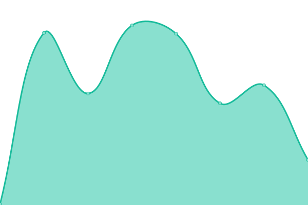

# [📈 Live Status](https://portal.procontact-solutions.fr): <!--live status--> **🟥 Complete outage**

This repository contains the open-source uptime monitor and status page for [pclmonitor](https://portal.procontact-solutions.fr), powered by [Upptime](https://github.com/upptime/upptime).

With [Upptime](https://upptime.js.org), you can get your own unlimited and free uptime monitor and status page, powered entirely by a GitHub repository. We use [Issues](https://github.com/pclmonitor/sv_uptime/issues) as incident reports, [Actions](https://github.com/pclmonitor/sv_uptime/actions) as uptime monitors, and [Pages](https://portal.procontact-solutions.fr) for the status page.

<!--start: status pages-->
<!-- This summary is generated by Upptime (https://github.com/upptime/upptime) -->
<!-- Do not edit this manually, your changes will be overwritten -->
<!-- prettier-ignore -->
| URL | Status | History | Response Time | Uptime |
| --- | ------ | ------- | ------------- | ------ |
|  [Portal ProContact](https://portal.procontact-solutions.fr) | 🟥 Down | [portal-pro-contact.yml](https://github.com/pclmonitor/sv_uptime/commits/HEAD/history/portal-pro-contact.yml) | 

 137ms
     
 | 

<a href="https://portal.procontact-solutions.fr/history/portal-pro-contact">0.00%</a>
    

|  [HR-EPR ProContact](https://erp.procontact-solutions.fr) | 🟥 Down | [hr-epr-pro-contact.yml](https://github.com/pclmonitor/sv_uptime/commits/HEAD/history/hr-epr-pro-contact.yml) | 

 140ms
     
 | 

<a href="https://portal.procontact-solutions.fr/history/hr-epr-pro-contact">0.00%</a>
    

|  [Instant Messaging Service](https://im.procontact-solutions.fr) | 🟥 Down | [instant-messaging-service.yml](https://github.com/pclmonitor/sv_uptime/commits/HEAD/history/instant-messaging-service.yml) | 

 0ms
     
 | 

<a href="https://portal.procontact-solutions.fr/history/instant-messaging-service">0.00%</a>
    

|  [Test Broken Site](https://thissitedoesnotexist.koj.co) | 🟥 Down | [test-broken-site.yml](https://github.com/pclmonitor/sv_uptime/commits/HEAD/history/test-broken-site.yml) | 

 0ms
     
 | 

<a href="https://portal.procontact-solutions.fr/history/test-broken-site">100.00%</a>
    

<!--end: status pages-->

[**Visit our status website →**](https://portal.procontact-solutions.fr)

## 📄 License

- Powered by: [Upptime](https://github.com/upptime/upptime)
- Code: [MIT](./LICENSE) © [pclmonitor](https://portal.procontact-solutions.fr)
- Data in the `./history` directory: [Open Database License](https://opendatacommons.org/licenses/odbl/1-0/)
